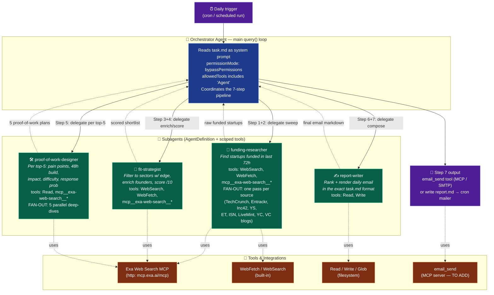

# Daily Startup Scout — Agent Architecture

> Automated career-strategy agent built on the **Claude Agent SDK** (`@anthropic-ai/claude-agent-sdk`).
> Runs once per day, finds freshly-funded startups, scores fit, designs proof-of-work projects,
> and emails a ranked daily report. See [`task.md`](./task.md) for the full spec.

---

## 1. Architecture Decision: Single vs. Multi-Agent

| Criterion | Single agent (one `query()` loop) | **Multi-agent (orchestrator + subagents)** ✅ |
| --- | --- | --- |
| Task shape | One linear job | 7 distinct stages, 2 of them fan out (N sources, top-5 startups) |
| Parallelism | None — serial tool calls | Discovery & deep-dive run **in parallel** per item |
| Context bloat | All 9 sources + 5 deep-dives pollute one window | Each subagent gets an **isolated context**; only summaries return |
| Separation of concerns | Research + scoring + writing tangled | Researcher / Strategist / Writer have focused system prompts + tool sets |
| Tool safety | One broad tool grant | Each subagent gets **least-privilege** tools (`tools` field) |
| Cost / latency | Cheaper per run, slower wall-clock | More tokens, but parallel fan-out is faster and more reliable |

**Decision → Multi-agent, orchestrator-worker pattern.**

The work is naturally a pipeline with two fan-out stages (Step 1 sweeps ~9 funding sources;
Step 5 deep-dives the top 5 startups). The SDK's [subagents](https://code.claude.com/docs/en/agent-sdk/subagents)
let the main `query()` loop act as an **orchestrator** that delegates isolated subtasks via the
`Agent` tool, keeping each worker's context clean and its tools scoped. A single agent would
work for an MVP, but would serialize all research, blow up its context window, and mix concerns.

---

## 2. Architecture Diagram

---

## 3. Pipeline ↔ Agent mapping

| task.md step | Owner | Mode |
| --- | --- | --- |
| **1.** Find startups funded in last 72h | `funding-researcher` | fan-out across ~9 sources |
| **2.** Keep only sectors with an edge | `funding-researcher` → `fit-strategist` | filter |
| **3.** Enrich (founder, LinkedIn, hiring page, team size) | `fit-strategist` | per startup |
| **4.** "Why hire Uditya?" + score /10 | `fit-strategist` | reasoning |
| **5.** Top-5: pain points, 48h proof-of-work, impact, difficulty, reply prob | `proof-of-work-designer` | **5 parallel deep-dives** |
| **6.** Rank = Learning × Hiring Prob × Accessibility | Orchestrator | synthesis |
| **7.** Render + send daily email | `report-writer` → `email_send` | output |

---

## 4. Implementation Notes (vs. current `src/agent.ts`)

The current scaffold is a **single-agent stub** — empty `prompt`, no `agents`, Exa MCP only.
To realize this architecture:

1. **Load `task.md` as the prompt / system prompt** instead of the empty string.
2. **Add the `Agent` tool** to `allowedTools` so the orchestrator can invoke subagents.
3. **Add an `agents: { ... }` map** with the four `AgentDefinition`s above, each with a focused
   `prompt` and a least-privilege `tools` array.
4. **Add `WebSearch`** (and keep `WebFetch`) so researchers aren't limited to a single source URL.
5. **Add an email mechanism** — an `email_send` MCP server (e.g. Resend/SMTP) for Step 7, or write
   `report.md` and let the cron job mail it. *(This is the one capability `task.md` requires that the
   current tool set is missing.)*
6. **Schedule it** — wrap the run in a daily cron / scheduled task so it executes "every day".
7. *(Optional)* Use **structured outputs** between stages so the shortlist/scores pass as typed JSON
   rather than free-form text.
