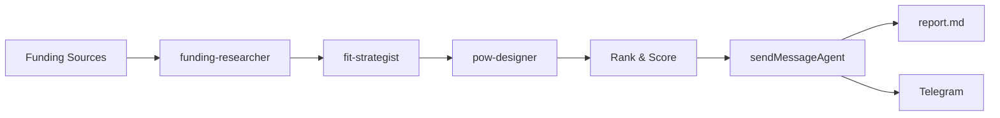

<div align="center">

<h1>Funding to Outreach</h1>

<p><strong>From startup funding news to a proof-of-work outreach plan, automatically every day.</strong></p>

<p>
An autonomous daily agent that discovers recently funded startups, scores strategic fit,
designs proof-of-work projects, and sends a ranked outreach report.
</p>

<p>
  
  
  
  
</p>

</div>

## Overview

**Funding to Outreach** is an autonomous daily research and outreach agent.

It monitors recent startup funding activity, filters companies by user-relevant sectors,
enriches each opportunity, scores strategic fit, designs a proof-of-work project, ranks
the results, and generates a decision-focused outreach report.

## Key Features

| Feature                    | Description                                                      |
| -------------------------- | ---------------------------------------------------------------- |
| Fresh Funding Discovery    | Finds startups that announced funding within the last 72 hours   |
| Sector Filtering           | Filters companies by sectors where you have a strategic edge     |
| Deep Enrichment            | Gathers founders, links, team info, and relevant public signals  |
| Fit Scoring                | Scores each opportunity using structured fit and learning criteria |
| Proof-of-Work Design       | Creates a sub-48-hour project idea for each selected startup     |
| Deterministic Ranking      | Ranks opportunities using reproducible scoring logic in code     |
| Daily Report Generation    | Produces a concise outreach report for daily review              |
| Local-First Persistence    | Writes report locally before attempting external delivery        |

## How It Works



## Deterministic Tools

Heavy data collection, parsing, filtering, and scoring are implemented as deterministic
tools under [`src/tools/`](./src/tools/). This keeps raw data out of the agent context
and makes critical operations reproducible.

| Tool                  | Server             | Purpose                                                                                                              |
| --------------------- | ------------------ | -------------------------------------------------------------------------------------------------------------------- |
| `get_recent_funding`  | `funding-feeds`    | Fetches funding RSS feeds, filters by date, applies keyword filters, deduplicates results, and returns compact JSON. |
| `get_gallery_funding` | `startups-gallery` | Scrapes `startups.gallery/news` and extracts funding announcements.                                                  |
| `get_india_funding`   | `ipo-platform`     | Scrapes Indian startup funding data from `ipoplatform.com`.                                                          |
| `check_url`           | `link-tools`       | Checks whether public URLs such as careers or hiring pages are live.                                                 |
| `rank_opportunities`  | `ranking-tools`    | Computes deterministic opportunity rankings.                                                                         |

## Tech Stack

| Component       | Technology                                                                                                                                                                                              |
| --------------- | ------------------------------------------------------------------------------------------------------------------------------------------------------------------------------------------------------- |
| Runtime         |                                                                                                                  |
| Language        |                                                                                                        |
| Agent Runtime   |                                                                                                       |
| Validation      |                                                                                                                             |
| Data Collection |                               |
| Delivery        |                |

## Quick Start

**Step 1:** Install dependencies
```bash
npm install
```

**Step 2:** Create environment file
```bash
cp .env.example .env
```

**Step 3:** Configure your API keys in `.env`

**Step 4:** Update your profile in [`src/config/profile.ts`](./src/config/profile.ts)

**Step 5:** Run the agent
```bash
npm start
```

**Step 6:** View live logs (opens `log-viewer.html`)
```bash
npm run view
```

The report is written to [`report.md`](./report.md).

## Configuration

Create a `.env` file from the example file:

```bash
cp .env.example .env
```

Then configure one supported model provider and Telegram delivery settings.

### Profile Setup

Update [`src/config/profile.ts`](./src/config/profile.ts) with your personal profile:

- **Edge sectors:** Industries where you have expertise or strategic advantage
- **Skills:** Your technical skills for fit scoring
- **Interests:** Topics that increase learning score for opportunities
- **Anti-interests:** Sectors to filter out (e.g., crypto, gaming, hardware)

This profile is used by the agent to score startup fit and design relevant proof-of-work projects.

## Supported Providers

| Provider           | Required Environment Variables                                                                               |
| ------------------ | ------------------------------------------------------------------------------------------------------------ |
| Anthropic API      | `ANTHROPIC_API_KEY`                                                                                          |
| Amazon Bedrock     | `CLAUDE_CODE_USE_BEDROCK`, `AWS_ACCESS_KEY_ID`, `AWS_SECRET_ACCESS_KEY`, `AWS_REGION`                        |
| Google Vertex AI   | `CLAUDE_CODE_USE_VERTEX`, `GOOGLE_APPLICATION_CREDENTIALS`, `ANTHROPIC_VERTEX_PROJECT_ID`, `CLOUD_ML_REGION` |
| OpenRouter         | `ANTHROPIC_BASE_URL`, `ANTHROPIC_API_KEY`                                                                    |
| Custom LLM Gateway | `ANTHROPIC_BASE_URL`, `ANTHROPIC_AUTH_TOKEN` or `ANTHROPIC_API_KEY`                                          |

Any gateway compatible with the Anthropic Messages API format can be used through
`ANTHROPIC_BASE_URL`.

See [`.env.example`](./.env.example) for all environment variables.

## Project Structure

```text
src/
  agent.ts          Main orchestrator pipeline
  schemas.ts        Zod schemas for validated handoffs
  agents/           Subagent definitions
  tools/            Deterministic MCP tools
  lib/              Ranking, logging, stage runner, and helpers
  config/           Funding feeds and user profile configuration
```

## Design Guarantees

* **Schema-validated handoffs:** All inter-agent communication uses typed JSON objects.
* **Deterministic ranking:** Opportunity ranking is computed in code, not by the model.
* **No fabricated founder data:** LinkedIn `/in/` URLs are emitted only when found verbatim in real source results.
* **Report persistence:** `report.md` is written before any external send attempt.
* **Graceful degradation:** Enrichment failures do not block the full report.
* **Bounded execution:** Each subagent has a `maxTurns` limit to prevent runaway loops.
* **Least-privilege agents:** Each subagent receives only the context needed for its task.

## Output

The agent produces a ranked Markdown report containing:

* Startup name and funding context.
* Sector and relevance summary.
* Fit score.
* Expected learning score.
* Deterministic ranking score.
* Proof-of-work project idea.
* Suggested outreach angle.
* Useful links and public references when available.

The report is written to:

```bash
report.md
```

## Roadmap

- [x] Deterministic funding tools
- [x] Orchestrator pipeline
- [x] Structured subagent outputs
- [x] Telegram delivery
- [ ] Daily scheduled trigger
- [ ] SQL lead store for cross-run deduplication
- [ ] Historical opportunity tracking
- [ ] Retry queues for failed enrichment stages
- [ ] Richer evaluation metrics for proof-of-work quality
- [ ] Configurable outreach templates

## Contributing

Contributions are welcome.

To contribute:

1. Fork the repository.
2. Create a feature branch.
3. Make a focused change.
4. Add or update tests where relevant.
5. Open a pull request with a clear description.

Please keep changes small, typed, and deterministic where possible.

## Development Notes

Before opening a pull request, verify that the project builds and the pipeline can run
without schema validation errors.

```bash
npm install
npm start
npm run view
```

When adding a new agent or tool, make sure the handoff contract is explicitly modeled
in [`src/schemas.ts`](./src/schemas.ts).

## License

This project is licensed under the [MIT License](./LICENSE).

See [`LICENSE`](./LICENSE) for details.

## Disclaimer

This project relies on public funding signals and third-party sources. Data quality may
vary by source availability, freshness, and access limits. Always review generated reports
before acting on outreach recommendations.

