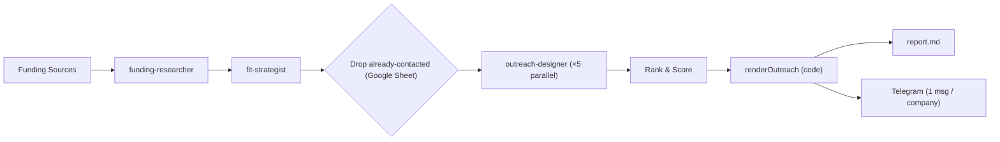

<h1>Funding to Outreach</h1>
<p>
  
  
  
  
</p>

An autonomous daily agent that discovers freshly-funded startups, scores fit, and sends one
personalized outreach email per top company. Each email is 80%-fixed / 20%-personalized,
chosen by skill track (Mobile / Web / GenAI), and timed to the company's HQ timezone.

## Key Features

| Feature                    | Description                                                      |
| -------------------------- | ---------------------------------------------------------------- |
| Fresh Funding Discovery    | Finds startups that announced funding within the last 72 hours   |
| Sector Filtering           | Filters companies by sectors where you have a strategic edge     |
| Deep Enrichment            | Gathers founders, links, team info, and relevant public signals  |
| Fit Scoring                | Scores each opportunity using structured fit and learning criteria |
| Skill-Track Categorization | Sorts each top company into Mobile / Web / GenAI to pick the right email template |
| Cross-Run Dedup            | Reads a Google Sheet of already-contacted companies live each run and excludes them before top-5 selection |
| Personalized Outreach      | Fills a fixed 80%-template with ~20% per-company personalization (greeting + ≤120-char hook) |
| Best-Send-Time             | Recommends when to send so the email lands ~9 AM in the company's HQ timezone |
| Deterministic Ranking      | Ranks opportunities using reproducible scoring logic in code     |
| Per-Company Delivery       | Sends one Telegram message per company, sequentially, best-first  |
| Local-First Persistence    | Writes report locally before attempting external delivery        |

## How It Works



## Deterministic Tools

Heavy data collection, parsing, filtering, and scoring are implemented as deterministic
tools under [`src/tools/`](./src/tools/). This keeps raw data out of the agent context
and makes critical operations reproducible.

| Tool                  | Server             | Purpose                                                                                                              |
| --------------------- | ------------------ | -------------------------------------------------------------------------------------------------------------------- |
| `get_recent_funding`  | `funding-feeds`    | Fetches funding RSS feeds, filters by date, applies keyword filters, deduplicates results, and returns compact JSON. |
| `get_gallery_funding` | `startups-gallery` | Scrapes `startups.gallery/news` and extracts funding announcements.                                                  |
| `get_india_funding`   | `ipo-platform`     | Scrapes Indian startup funding data from `ipoplatform.com`.                                                          |
| `rank_opportunities`  | `ranking-tools`    | Computes deterministic opportunity rankings.                                                                         |

## Tech Stack

| Component       | Technology                                                                                                                                                                                              |
| --------------- | ------------------------------------------------------------------------------------------------------------------------------------------------------------------------------------------------------- |
| Runtime         |                                                                                                                  |
| Language        |                                                                                                        |
| Agent Runtime   |                                                                                                       |
| Validation      |                                                                                                                             |
| Data Collection |                               |
| Delivery        |                |

## Quick Start

```bash
npm install         # 1. install dependencies
npm run config      # 2. open the visual config editor at localhost:4321
npm start           # 3. run the agent
npm run view        # 4. (optional) view live logs
```

Everything is configured in the **config editor** (`npm run config`) — no code editing
required. It opens a single-page UI with four tabs:

- **Profile** — your name, summary, timezone, links, and the sector/role lists that drive
  filtering and fit scoring.
- **Funding Feeds** — the RSS sources swept for funding news.
- **Email Templates** — the full outreach email per skill track (Mobile / Web / GenAI),
  edited directly with `{tokens}` filled in per company.
- **Credentials** — your `.env` keys as editable `KEY = value` rows (model provider,
  Telegram, Google Sheets). Creates `.env` if it doesn't exist yet.

Saving writes straight to disk (`src/config/*.data.json` and `.env`). Restart `npm start`
to pick up changes. The report is written to [`report.md`](./report.md).

## Configuration

Run `npm run config` and fill in the tabs above. At minimum you need:

- One **model provider** (e.g. `ANTHROPIC_API_KEY`) — see [Supported Providers](#supported-providers).
- **Telegram** delivery: `BOT_TOKEN` and `CHAT_ID`.
- Optionally **Google Sheets** cross-run dedup: `SHEETS_API_KEY` and `SHEET_ID` (below).

> Prefer editing files directly? The same values live in `src/config/*.data.json` and
> `.env`; the config UI just edits those for you.

### Contacted-Companies Sheet (cross-run dedup)

The agent reads a Google Sheet of companies you've already reached out to and skips them
before picking the top 5, so you never re-contact the same startup. The sheet is read
**live on every run** via the Google Sheets REST API (read-only, no dependency, free tier).

**Sheet layout:** column **A** = Company Name, column **B** = Website (row 1 is a header).
A startup is excluded if **either** its name **or** its root domain matches a row.

**Setup:**

1. In Google Cloud, enable the **Google Sheets API** and create an **API key**
   (restrict it to the Sheets API). No billing account is needed — reads are free.
2. Share the sheet as **"Anyone with the link → Viewer"**.
3. In the config editor's **Credentials** tab (or directly in `.env`), set:
   - `SHEETS_API_KEY` — your API key
   - `SHEET_ID` — the ID in `docs.google.com/spreadsheets/d/<SHEET_ID>/edit`

If these are unset or the fetch fails, dedup is skipped gracefully (the run contacts
everyone) rather than erroring.

## Supported Providers

| Provider           | Required Environment Variables                                                                               |
| ------------------ | ------------------------------------------------------------------------------------------------------------ |
| Anthropic API      | `ANTHROPIC_API_KEY`                                                                                          |
| Amazon Bedrock     | `CLAUDE_CODE_USE_BEDROCK`, `AWS_ACCESS_KEY_ID`, `AWS_SECRET_ACCESS_KEY`, `AWS_REGION`                        |
| Google Vertex AI   | `CLAUDE_CODE_USE_VERTEX`, `GOOGLE_APPLICATION_CREDENTIALS`, `ANTHROPIC_VERTEX_PROJECT_ID`, `CLOUD_ML_REGION` |
| OpenRouter         | `ANTHROPIC_BASE_URL`, `ANTHROPIC_API_KEY`                                                                    |
| Custom LLM Gateway | `ANTHROPIC_BASE_URL`, `ANTHROPIC_AUTH_TOKEN` or `ANTHROPIC_API_KEY`                                          |

Any gateway compatible with the Anthropic Messages API format can be used through
`ANTHROPIC_BASE_URL`.

See [`.env.example`](./.env.example) for all environment variables.

## Project Structure

```text
public/
  config/           Config editor server + UI (npm run config)
  logging/          Live log viewer server + UI (npm run view)
src/
  agent.ts          Main orchestrator pipeline
  schemas.ts        Zod schemas for validated handoffs
  agents/           Subagent definitions
  tools/            Deterministic MCP tools
  lib/              Ranking, send-window, contacted-sheet dedup, logging, stage runner, and helpers
  config/           *.ts modules + editable *.data.json (profile, feeds, email templates)
```

## Design Guarantees

* **Schema-validated handoffs:** All inter-agent communication uses typed JSON objects.
* **Deterministic ranking:** Opportunity ranking is computed in code, not by the model.
* **No fabricated data:** Founder greeting falls back to "there" and HQ location/timezone to "not_found" unless grounded in a real source — names and locations are never invented.
* **Cross-run dedup:** Companies already in the contacted Google Sheet are excluded before top-5 selection; a Sheets outage degrades to "contact everyone" rather than failing the run.
* **Report persistence:** `report.md` is written before any external send attempt.
* **Graceful degradation:** Enrichment failures do not block the full report.
* **Bounded execution:** Each subagent has a `maxTurns` limit to prevent runaway loops.
* **Least-privilege agents:** Each subagent receives only the context needed for its task.

## Output

The agent produces one outreach email per top-5 company, each containing:

* A metadata header: rank, funding context, fit score, and best send time.
* The skill track it was categorized into (Mobile / Web / GenAI).
* A personalized greeting and a ≤120-char opening observation grounded in enrichment.
* The fixed skill-track body (focus line, project proof, closing) and signature.

Each company is sent as a separate Telegram message (sequentially, best-first). All
messages are also written, joined by `---`, to:

```bash
report.md
```

## Roadmap

- [x] Deterministic funding tools
- [x] Orchestrator pipeline
- [x] Structured subagent outputs
- [x] Telegram delivery
- [x] Google Sheets lead store for live cross-run deduplication
- [ ] Daily scheduled trigger
- [ ] Historical opportunity tracking
- [ ] Retry queues for failed enrichment stages
- [x] Configurable outreach templates (Mobile / Web / GenAI)
- [ ] Per-track A/B testing of outreach copy

## Contributing

Contributions are welcome.

To contribute:

1. Fork the repository.
2. Create a feature branch.
3. Make a focused change.
4. Add or update tests where relevant.
5. Open a pull request with a clear description.

Please keep changes small, typed, and deterministic where possible.

## Development Notes

Before opening a pull request, verify that the project builds and the pipeline can run
without schema validation errors.

```bash
npm install
npm start
npm run view
```

When adding a new agent or tool, make sure the handoff contract is explicitly modeled
in [`src/schemas.ts`](./src/schemas.ts).

## License

This project is licensed under the [MIT License](./LICENSE).

See [`LICENSE`](./LICENSE) for details.

## Disclaimer

This project relies on public funding signals and third-party sources. Data quality may
vary by source availability, freshness, and access limits. Always review generated reports
before acting on outreach recommendations.

